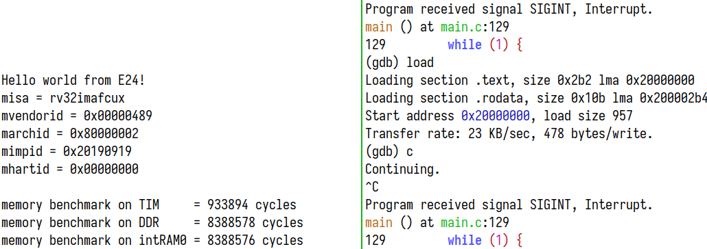

# JH7100 E24 baremetal demo

A demo baremetal program that runs on the JH7100's E24 core.



## Usage

```console
$ make -C src CROSS_COMPILE=riscv32-none-elf-
$ gdb src/demo.elf
(gdb) target remote :3333
(gdb) load
(gdb) c
```
